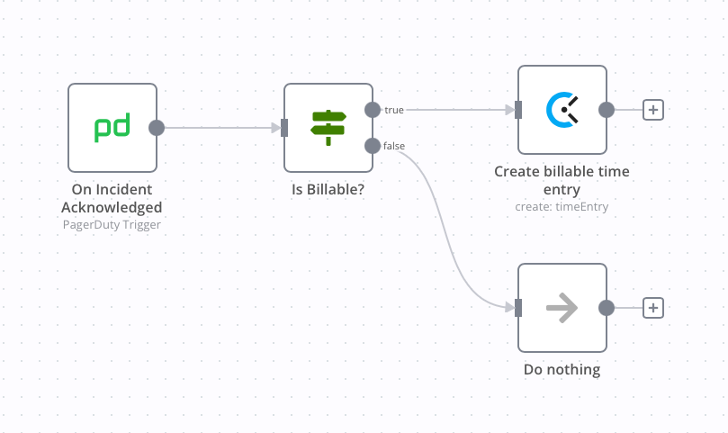
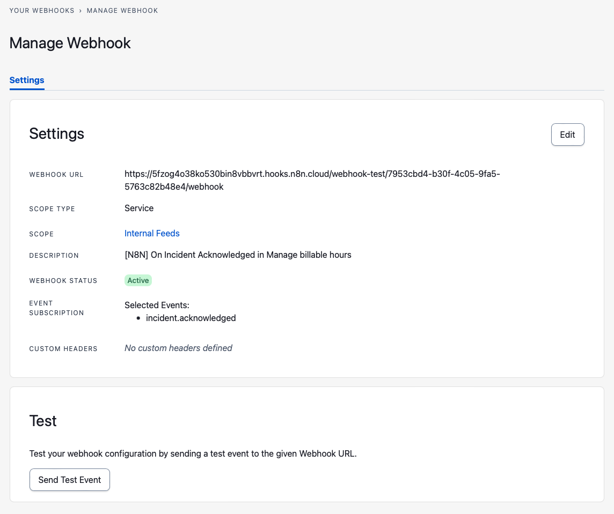

# PagerDuty Trigger for n8n

This trigger node allows you to receive updates in your [n8n](https://www.n8n.io) workflows when significant events happen in your PagerDuty account. For example, when an incident triggers, escalates or resolves. See the `Events Supported` support section below for a full list of events.

## How to install

### Community Nodes (Recommended)

For users on n8n v0.187+, your instance owner can install this node from [Community Nodes](https://docs.n8n.io/integrations/community-nodes/installation/).

1. Go to **Settings > Community Nodes**.
2. Select **Install**.
3. Enter `n8n-nodes-pagerduty-trigger` in **Enter npm package name**.
4. Agree to the [risks](https://docs.n8n.io/integrations/community-nodes/risks/) of using community nodes: select **I understand the risks of installing unverified code from a public source**.
5. Select **Install**.

After installing the node, you can use it like any other node. n8n displays the node in search results in the **Nodes** panel.

### Manual installation

To get started install the package in your n8n root directory:

`npm install n8n-nodes-pagerduty-trigger`

For Docker-based deployments, add the following line before the font installation command in your [n8n Dockerfile](https://github.com/n8n-io/n8n/blob/master/docker/images/n8n/Dockerfile):

`RUN cd /usr/local/lib/node_modules/n8n && npm install n8n-nodes-pagerduty-trigger`

## Node Reference

## Credentials

You can find authentication information for this node [here](https://docs.n8n.io/integrations/builtin/credentials/pagerduty/).
## Events

You can customize which [event types](https://developer.pagerduty.com/docs/ZG9jOjQ1MTg4ODQ0-overview#event-types) will trigger the node. A subset of all event types may be provided if you are only interested in a limited set of events.

The following resources and event types are available using [PagerDuty's Webhook Subscriptions API](https://developer.pagerduty.com/api-reference/b3A6MjkyNDc4NA-create-a-webhook-subscription). 

### Incidents

| Event                              | Description                                                                                |
| ---------------------------------- | ------------------------------------------------------------------------------------------ |
| [`Incident Acknowledged`](https://developer.pagerduty.com/docs/ZG9jOjQ1MTg4ODQ0-overview#incidentacknowledged) | Triggered when an incident is wledged                                                      |
| [`Incident Annotated`](https://developer.pagerduty.com/docs/ZG9jOjQ1MTg4ODQ0-overview#incidentannotated) | Triggered when a note is added to an incident                                              |
| [`Incident Delegated`](https://developer.pagerduty.com/docs/ZG9jOjQ1MTg4ODQ0-overview#incidentdelegated) | Triggered when an incident has been reassigned to another escalation policy                |
| [`Incident Escalated`](https://developer.pagerduty.com/docs/ZG9jOjQ1MTg4ODQ0-overview#incidentescalated) | Triggered when an incident has been escalated to another user in the same escalation level |
| [`Incident Reassigned`](https://developer.pagerduty.com/docs/ZG9jOjQ1MTg4ODQ0-overview#incidentreassigned) | Triggered when an incident has been reassigned to another user                             |
| [`Incident Reopened`](https://developer.pagerduty.com/docs/ZG9jOjQ1MTg4ODQ0-overview#incidentreopened) | Triggered when an incident is reopened                                                     |
| [`Incident Resolved`](https://developer.pagerduty.com/docs/ZG9jOjQ1MTg4ODQ0-overview#incidentresolved) | Triggered when an incident has been resolved                                               |
| [`Incident Status Update Published`](https://developer.pagerduty.com/docs/ZG9jOjQ1MTg4ODQ0-overview#incidentstatus_update_published) | Triggered when a status update is added to an incident                                     |
| [`Incident Triggered`](https://developer.pagerduty.com/docs/ZG9jOjQ1MTg4ODQ0-overview#incidenttriggered) | Triggered when an incident is newly created/triggered                                      |
| [`Incident Unacknowledged`](https://developer.pagerduty.com/docs/ZG9jOjQ1MTg4ODQ0-overview#incidentunacknowledged) | Triggered when an incident is unacknowledged                                               |
| [`Incident Responder Added`](https://developer.pagerduty.com/docs/ZG9jOjQ1MTg4ODQ0-overview#incidentresponderadded) | Triggered when a responder has been added to an incident                                   |
| [`Incident Responder Replied`](https://developer.pagerduty.com/docs/ZG9jOjQ1MTg4ODQ0-overview#incidentresponderreplied) | Triggered when a responder replies to a request                                            |
| [`Incident Priority Updated`](https://developer.pagerduty.com/docs/ZG9jOjQ1MTg4ODQ0-overview#incidentpriority_updated) | Triggered when the priority of an incident has changed                                     |

### Services

| Event      | Description                         |
| ---------- | ----------------------------------- |
| [`Service Created`](https://developer.pagerduty.com/docs/ZG9jOjQ1MTg4ODQ0-overview#servicecreated)  | Triggered when a service is created |
| [`Service Deleted`](https://developer.pagerduty.com/docs/ZG9jOjQ1MTg4ODQ0-overview#servicedeleted)  | Triggered when a service is deleted |
| [`Service Updated`](https://developer.pagerduty.com/docs/ZG9jOjQ1MTg4ODQ0-overview#serviceupdated)  | Triggered when a service is updated |

Additional event types may be added to this list over time.

## Filtering Events Using Scopes

The **Scope** parameter specifies which source of events will trigger the node. There are currently three types of scopes that can be applied: `Service`, `Team` and `Account`. By default, the `Account` scope is used and all configured events for the account will trigger the node.

In the case of incident events, the different scopes will only trigger for the incidents that are associated with the service or team. For example: a trigger node with a service scope would only trigger for all incidents belonging to the specified service.
## Options

### Include Headers and Query Parameters

By default, you'll receive the event body as your JSON. You can choose whether to return the full details of the request, including headers and query parameters instead of only the body.

<strong>Body-only (Default)</strong>

<pre>
{
	"event": {
		"id": "01D8FYLHB5WAOASD!BWY4P3M",
		"event_type": "pagey.ping",
		"resource_type": "pagey",
		"occurred_at": "2022-10-01T02:30:53.852Z",
		"agent": null,
		"client": null,
		"data": {
			"message": "Hello from your friend Pagey!",
			"type": "ping"
		}
	}
}
</pre>

<strong>Headers and Query Parameters Included</strong>

<pre>
{
	"body": {
		"event": {
			"id": "01D8FYLHB5WAOASD!BWY4P3M",
			"event_type": "pagey.ping",
			"resource_type": "pagey",
			"occurred_at": "2022-10-01T02:30:53.852Z",
			"agent": null,
			"client": null,
			"data": {
				"message": "Hello from your friend Pagey!",
				"type": "ping"
			}
		}
	},
	"headers": {
		"host": "n8n.host.dev",
		"content-length": "228",
		"accept": "application/json",
		"x-webhook-id": "a3d6149f-7577-4e8c-bc7c-e0e80e1s3a5",
		"user-agent": "PagerDuty-Webhook/V3.0",
		"x-pagerduty-signature": "v1=6786170fa823ba565f041fb9186719f29907e6460dssss2ce233abf676bdfe9e1",
		"x-webhook-subscription": "PXSUIZH",
		"content-type": "application/json"
	},
	"query": {}
}
</pre>

### Custom Headers

You can define optional headers that will be passed along with the payload to the destination URL. The header values are redacted in GET requests, but are not redacted on the webhook when delivered to trigger node. All header names must be unique.

When sending custom headers, the JSON for the event will have headers and query parameters will always included.
## Troubleshooting / Testing

If you're having issues with the webhook subscriptions, you can review the webhook subscriptions in PagerDuty using the **Integrations** > **Generic Webhooks (v3)** menu.

You send also send a test event to your listening trigger node here as well:

## License

MIT License

Copyright (c) 2022 Nicholas Penree <nick@penree.com>

Permission is hereby granted, free of charge, to any person obtaining a copy
of this software and associated documentation files (the "Software"), to deal
in the Software without restriction, including without limitation the rights
to use, copy, modify, merge, publish, distribute, sublicense, and/or sell
copies of the Software, and to permit persons to whom the Software is
furnished to do so, subject to the following conditions:

The above copyright notice and this permission notice shall be included in all
copies or substantial portions of the Software.

THE SOFTWARE IS PROVIDED "AS IS", WITHOUT WARRANTY OF ANY KIND, EXPRESS OR
IMPLIED, INCLUDING BUT NOT LIMITED TO THE WARRANTIES OF MERCHANTABILITY,
FITNESS FOR A PARTICULAR PURPOSE AND NONINFRINGEMENT. IN NO EVENT SHALL THE
AUTHORS OR COPYRIGHT HOLDERS BE LIABLE FOR ANY CLAIM, DAMAGES OR OTHER
LIABILITY, WHETHER IN AN ACTION OF CONTRACT, TORT OR OTHERWISE, ARISING FROM,
OUT OF OR IN CONNECTION WITH THE SOFTWARE OR THE USE OR OTHER DEALINGS IN THE
SOFTWARE.
